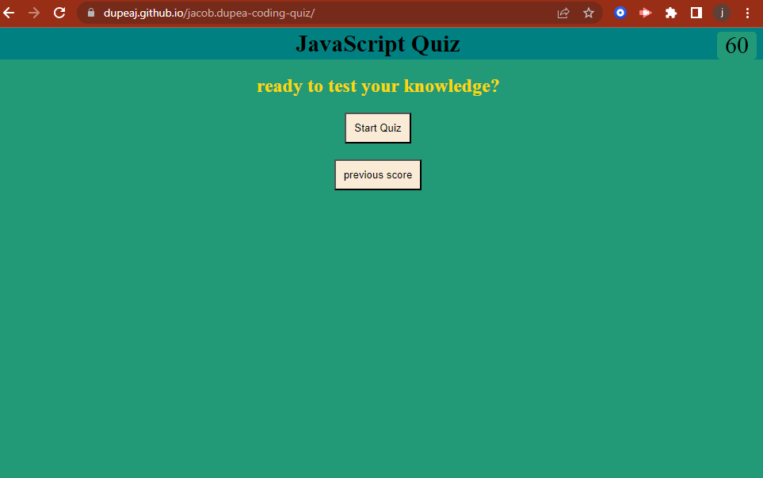
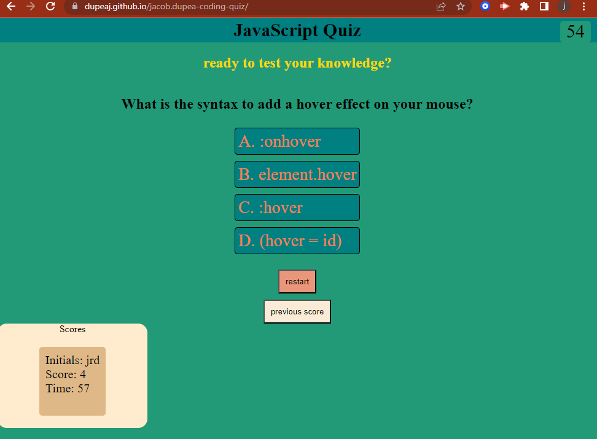
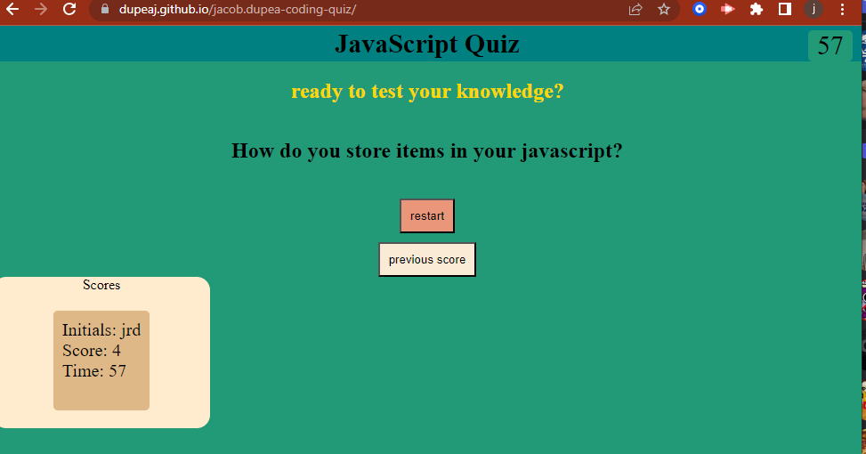

  

  <h3 align="center">Jacobs coding quiz</h3>

  

    An awesome quiz to test your knowledge!
  

 
<h2 align="center"> Description</h2>

For my Challenge 4, I was tasked with making JavaScript functional coding quiz. It includes questions, answers, and a tracking score sheet.

Making my coding quiz has really had its challenges, working with if statements and conditonals had mostly been new to me so it was a little challenging for me and I needed a lot of research.i learned a lot from putting the quiz together especially working with local storage.

The Quiz lets you take a quiz to test your knowledge of javaScript with a series of questions that lets the user select an answer and see if it is wrong or correct. at the end of the quiz the user is prompted to put their initials, and then stats of score time will be list aslong as the initials.  </b>

## Installation

Available with website link

[Coding Quiz]

(https://dupeaj.github.io/Jacob.Dupea-coding-quiz/)

## Photos

<h3 align="center">Website functions with interactions</h3>

  

  
 

## usage
<ul>
  <li>Press start quiz to begin, then click an answer to the questions.</li>
  <li>Click restart if u want to start the quiz over.</li>
  <li>Once finished with all the questions a prompt appears for your initials.</li>
  <li>Input initials and press okay to display current stats.</li>
  <li>press previous score to display the most recent test taken.</li>
</ul>

## License

License is a general MIT license. Refer to the License in the repo.
